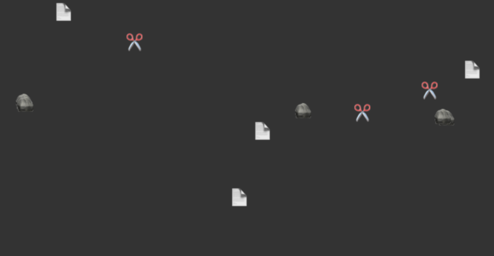

# Tutorial: Rock 🪨 Paper 📄 Scissors ✂️ Animation

A step-by-step tutorial on creating your own rock paper scissors animation.

This is a fairly easy animation to program, but can be quite fascinating to watch. Each piece, whether it's a rock 🪨, paper 📄 or scissors ✂️ will attempt to take over other pieces. With the piece winning according to the rule: rock smashes scissors, scissors cuts paper, paper wraps rock.

The tutorial will cover three main parts:

- **Render loop:** How to create a render loop using Canvas and `requestAnimationFrame`.

- **Vector logic:** Adding, subtracting and multiplying points in a 2D space.

- **Update behaviour:** Configuring each piece to independently decide how to move.

**No dependencies.** This tutorial is focused on learning how things work under the hood. For production code, I'd recommend considering using stable and well tested libraries.

For a working example, check out [the complete source-code](./example-final/src/main.ts).

Next: [Chapter One - Setup](./1-Setup.md)

By [@jahredhope](https://jahred.me/)
